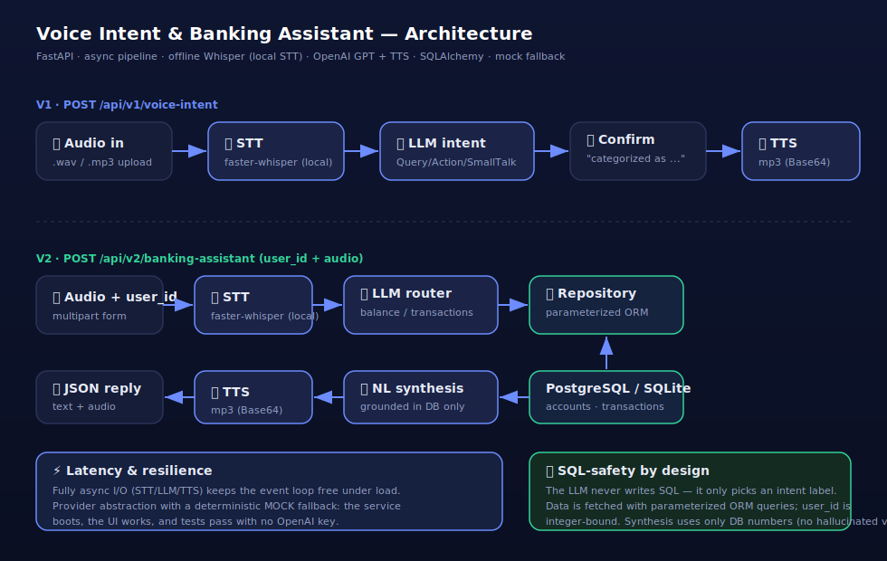

# 🎙️ Voice Intent & Personal Banking Voice Assistant

A single, production-minded **FastAPI** service that implements both interview tasks in one clean codebase:

| Version | Endpoint | What it does |
|---|---|---|
| **V1 — Voice Intent Agent** | `POST /api/v1/voice-intent` | Audio → transcript → intent (`Query` / `Action` / `SmallTalk`) → spoken confirmation |
| **V2 — Banking Voice Assistant** | `POST /api/v2/banking-assistant` | Audio + `user_id` → transcript → DB lookup → natural spoken answer grounded in real account data |

The pipeline is **Ears → Brain → Mouth**: **offline Whisper** via `faster-whisper` (STT, runs locally) → **GPT-4o-mini** (reasoning) → **OpenAI TTS** (speech), all async.

> **STT is fully local.** Speech-to-text uses a local Whisper model (`faster-whisper`) — no audio leaves the machine and no key is needed for transcription. The model is downloaded once from HuggingFace, then runs offline. Only the LLM and TTS use OpenAI; without `OPENAI_API_KEY` they fall back to deterministic stubs, and `MOCK_MODE=true` stubs everything (used by the test suite to skip the model load).

---

## 🏗️ Architecture



```
            ┌─────────┐   ┌──────────┐   ┌──────────────┐   ┌──────────┐
 V1  audio ─►   STT   ├──►│   LLM    ├──►│  confirm txt ├──►│   TTS    ├─► JSON {transcript, intent, audio}
            │ Whisper │   │  intent  │   └──────────────┘   │  tts-1   │
            └─────────┘   └──────────┘                      └──────────┘

            ┌─────────┐   ┌──────────┐   ┌──────────────┐   ┌──────────┐   ┌──────────┐
 V2 audio ─►│   STT   ├──►│   LLM    ├──►│  Repository  ├──►│   LLM    ├──►│   TTS    ├─► JSON {answer, data, audio}
   +user_id │ Whisper │   │  router  │   │ (parametrized│   │ synthesis│   │  tts-1   │
            └─────────┘   └──────────┘   │   ORM query) │   │ DB-only  │   └──────────┘
                                         └──────┬───────┘   └──────────┘
                                                ▼
                                     accounts / transactions  (SQLite/Postgres)
```

### Project layout

```
app/
├── main.py              # FastAPI app + both endpoints (async)
├── config.py            # settings + auto mock fallback
├── schemas.py           # Pydantic request/response contracts
├── services/
│   ├── stt.py           # Speech-to-Text  (OFFLINE faster-whisper + mock)
│   ├── llm.py           # intent classification + grounded synthesis (+ mock)
│   ├── tts.py           # Text-to-Speech  (OpenAI TTS + mock)
│   └── openai_client.py # shared async client factory
├── db/
│   ├── models.py        # accounts, transactions (ORM)
│   ├── repository.py    # the ONLY place SQL runs — parameterized
│   ├── database.py      # engine/session
│   └── seed.py          # deterministic demo data
└── static/index.html    # mini web UI
tests/                   # pytest suite (runs in mock mode)
docs/architecture.svg
Dockerfile · docker-compose.yml · requirements.txt
```

---

## 🚀 Quick start

> **Requirements:** Python **3.10–3.13** (the pinned `pydantic` has no prebuilt wheels for 3.14 yet, which forces a Rust source build). Docker avoids this entirely — it ships Python 3.12.

### Option A — Docker (recommended)

```bash
# offline Whisper STT works out of the box; LLM/TTS stubbed without a key
docker compose up --build
# → open http://localhost:8000

# with real OpenAI LLM + TTS as well
OPENAI_API_KEY=sk-... docker compose up --build
```

### Option B — Local Python

```bash
python -m venv .venv && source .venv/bin/activate
pip install -r requirements.txt

# optional: real OpenAI LLM + TTS (STT is already local/offline)
cp .env.example .env   # add your OPENAI_API_KEY

uvicorn app.main:app --reload
# → open http://localhost:8000
```

Open **http://localhost:8000** for the mini UI, or **/docs** for interactive Swagger.

> **First run:** the offline Whisper model (~140 MB for `base`) is downloaded once from HuggingFace, then cached and used fully offline. It is **pre-loaded at server startup** (warm-up), so the site only reports "Application startup complete" once the model is ready and the first request is fast. To skip the model entirely (e.g. CI or a quick demo), set `MOCK_MODE=true`.

---

## ⚙️ Configuration

All settings are environment variables (read from `.env`). Copy `.env.example` → `.env` and adjust.

| Variable | Default | Description |
|---|---|---|
| `OPENAI_API_KEY` | _(empty)_ | OpenAI key for LLM + TTS. Empty → those steps run as stubs. STT never needs it. |
| `LLM_MODEL` | `gpt-4o-mini` | Chat model for intent + synthesis. `gpt-4.1-nano` is the cheapest viable option. |
| `TTS_MODEL` | `tts-1` | OpenAI text-to-speech model. |
| `TTS_VOICE` | `alloy` | TTS voice. |
| `WHISPER_MODEL` | `base` | Local Whisper size: `tiny` / `base` / `small` / `medium` / `large-v3`. |
| `WHISPER_DEVICE` | `cpu` | `cpu` or `cuda`. |
| `WHISPER_COMPUTE_TYPE` | `int8` | `int8` (CPU) or `float16` (GPU). |
| `WHISPER_LANGUAGE` | `en` | Force a language. Empty = auto-detect (multilingual). |
| `WHISPER_BEAM_SIZE` | `1` | `1` = greedy = fastest. |
| `PRELOAD_STT` | `true` | Load the Whisper model at startup instead of on the first request. |
| `MOCK_MODE` | `false` | Stub **all** providers (STT/LLM/TTS). Used by tests/CI; no key or download needed. |
| `DATABASE_URL` | `sqlite:///./banking.db` | SQLAlchemy URL. Swap for Postgres in production. |

**Run modes at a glance**

| Mode | STT | LLM + TTS |
|---|---|---|
| No key (default) | ✅ real offline Whisper | 🟡 deterministic stubs |
| With `OPENAI_API_KEY` | ✅ real offline Whisper | ✅ real GPT + TTS audio |
| `MOCK_MODE=true` | 🟡 stub (filename hint) | 🟡 stubs — fully offline, no download |

---

## 🖥️ Using the mini UI

Open **http://localhost:8000**.

**V1 · Voice Intent** — click **Record** and speak (English), or **Upload** a `.wav`/`.mp3`, then **Send**. You get the transcript, the intent badge (`Query` / `Action` / `SmallTalk`), and a spoken confirmation. In mock mode you can just type into *Spoken text (demo)*.

**V2 · Banking Assistant** — switch to the V2 tab, set a **User ID** (see the seeded table below), then ask a balance or spending question:
- *"How much money do I have?"* → `balance`
- *"Where did I spend money yesterday?"* → `transactions`

The response shows the intent, a natural answer grounded in the DB (e.g. *"Your current balance is 1250 UZS."*), the raw JSON used, and the spoken audio. Try **User ID 3** to see the graceful no-data response.

> Questions must be in English (Whisper is pinned to `en`) and about balance/transactions, otherwise the intent is `unknown` and the assistant asks you to rephrase.

---

## 🔌 API

### V1 — `POST /api/v1/voice-intent`
`multipart/form-data`: `file` = audio (.wav/.mp3)

```json
{
  "transcript": "What is the price of Bitcoin today?",
  "intent": "Query",
  "reply_text": "I have categorized your request as Query.",
  "audio_base64": "…mp3…",
  "latency_ms": 412.7,
  "mock": false
}
```

### V2 — `POST /api/v2/banking-assistant`
`multipart/form-data`: `user_id` (int) + `file` (audio)

```json
{
  "transcript": "How much money do I have?",
  "intent": "balance",
  "answer_text": "Your current balance is 1250 UZS.",
  "data": { "kind": "balance", "found": true, "balance": "1250", "currency": "UZS" },
  "audio_base64": "…mp3…",
  "latency_ms": 530.2,
  "mock": false
}
```

Try them all:

```bash
bash examples/requests.sh
```

### Seeded demo data

| user_id | balance | transactions |
|---|---|---|
| 1 | 1250 UZS | Korzinka 50000 (yesterday), Yandex Go 12000 (today), Evos 8500 |
| 2 | 500 USD | Starbucks 42.50, Uber 120 |
| 3 | 0 UZS | **none** (no-data edge case) |

---

## ✅ How this maps to the evaluation criteria

**Latency.** Every external call (STT, LLM, TTS) is `async`, and OpenAI access goes through one pooled `AsyncOpenAI` client. The event loop is never blocked, so the server stays responsive under concurrent voice traffic. Server-side processing time is returned in `latency_ms` on every response for easy measurement. The architecture is endpoint-per-stage and stateless, so it can be split into a streaming pipeline later.

**Logic & prompting.** Intent classification uses the Chat Completions **JSON mode** with `temperature=0` and a closed label set — the output is a strict, parseable contract rather than brittle string matching. Prompts define each label, handle empty/unintelligible speech with explicit defaults, and the code falls back to a safe label if the model ever returns something off-contract.

**Architecture.** Clean separation of concerns: transport (`main.py`) ↔ AI services (`services/`) ↔ data (`db/`). Providers sit behind a thin abstraction with a deterministic mock, so the service is runnable and testable with no external dependencies and providers can be swapped without touching endpoints.

**Tool selection.** Production-grade, batteries-included choices: **offline Whisper** (`faster-whisper`/CTranslate2) for robust multilingual STT that runs locally — no per-request cost and no audio sent to a third party (a real advantage for banking/PII data) — **GPT-4o-mini** for cheap/fast reasoning, **OpenAI TTS** for natural speech, **FastAPI** for async + auto OpenAPI docs, **SQLAlchemy** for safe DB access. The blocking transcription runs in a worker thread so it never stalls the event loop.

**Accuracy (V2).** Numbers come only from the database. The repository formats the values, and the synthesis prompt is explicitly constrained to use *only* the provided JSON — no estimation or invention. In mock mode the answer is templated from the same data, so figures can never drift.

**SQL safety (V2).** **The LLM never writes SQL.** It only selects an intent label from a closed set; the actual fetch is a **parameterized SQLAlchemy ORM query** with `user_id` bound as an integer. This removes the LLM-driven SQL-injection surface entirely. A test fires a `DROP TABLE` transcript and verifies the table survives. (A text-to-SQL approach is possible but trades safety for flexibility we don't need here — see *Design notes* in `app/services/llm.py`.)

**Data handling.** No-data cases are first-class: an empty transaction list yields *"You don't have any recent transactions on record."* and a missing account yields a clear message rather than a crash or a fabricated number (covered by `test_v2_no_data`).

---

## 🧪 Tests

```bash
pip install -r requirements.txt
pytest -v
```

Covers V1 intent classification, V2 routing, DB-grounded synthesis, the no-data path, SQL-injection safety, input validation, and both endpoints end-to-end — all offline in mock mode.

---

## 🩺 Troubleshooting

**`pip install` fails building `pydantic-core` (Rust/PyO3 error).** You're on Python 3.14, which has no prebuilt wheels yet. Use Python 3.10–3.13 (`python3.12 -m venv .venv`) or run via Docker (ships 3.12).

**`502 — OpenAI (LLM/TTS) call failed: ... insufficient_quota`.** The key has no credit. Add billing at <https://platform.openai.com/settings/organization/billing> (a few dollars is plenty), wait 1–2 min, retry. STT still works without credit.

**First request hangs / no download bar.** On first real use the Whisper model downloads (~140 MB). With `PRELOAD_STT=true` this happens at startup — watch the server console. If you don't see a bar, the model is already cached in `~/.cache/huggingface/hub`.

**Transcription returns gibberish / wrong language.** Short or noisy clips can be mis-detected. The language is pinned to English (`WHISPER_LANGUAGE=en`); for better accuracy use `WHISPER_MODEL=small`.

**Microphone not available in the browser.** Use `http://localhost:8000` (not a file path); some browsers require a secure/localhost context for mic access.

---

## 🧭 Production next steps

Streaming STT/TTS for true real-time voice; auth + per-user authorization on `user_id`; rate limiting; structured logging/tracing for latency budgets; and a Postgres deployment (just set `DATABASE_URL`).

---

## 📦 Push to GitHub

The repo is already initialised with a first commit. Create an empty repo on GitHub, then:

```bash
cd banking-voice-assistant
git remote add origin https://github.com/<you>/voice-banking-assistant.git
git branch -M main
git push -u origin main
```

`.env` (your secrets) is gitignored and will **not** be pushed.

---

## 📄 License

MIT — see [LICENSE](LICENSE).
